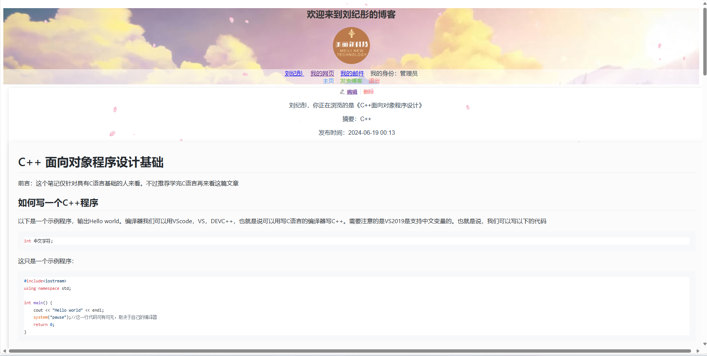
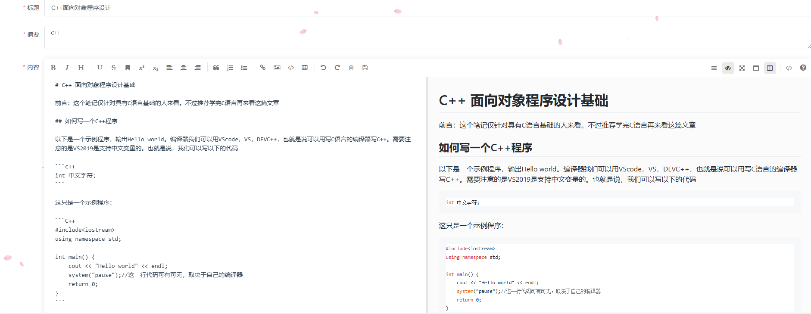
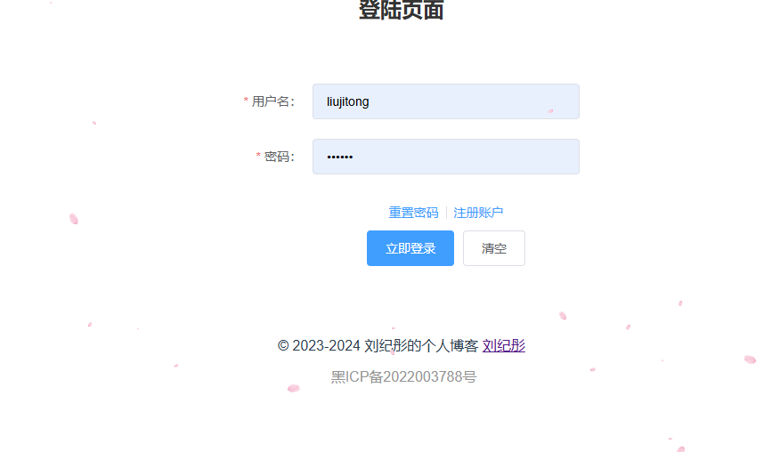
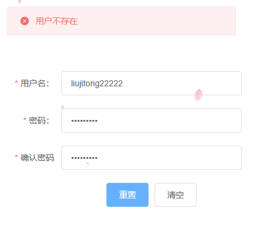
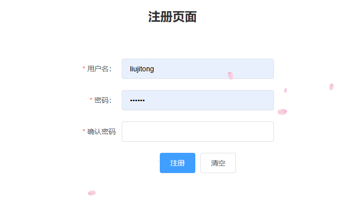
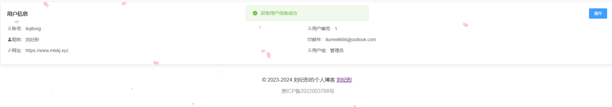
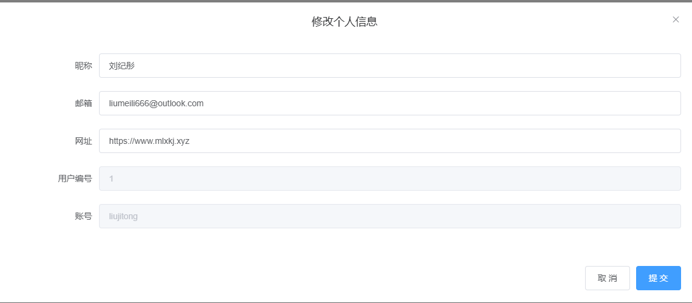
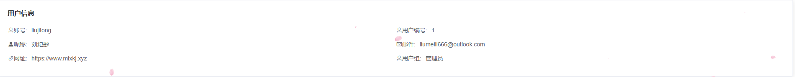

# Web程序设计期末作业报告

[toc]

## 项目来源及背景

随着互联网技术的发展和应用，作为一个程序员或者说软件开发的从业者，一个好的博客网站不仅仅是自己的技术实力的体现，写博客也是一种学习方法，可以加深自己的印象，互联网的核心就是分享，所以我选择来用本次所学知识写一个网站用来充当自己的博客，同时也可以分享给他人。

伴随着Web技术的发展，现在的Web开发已经不再是简单的HTML+CSS+JS的组合，而是一个完整的生态圈，前端框架层出不穷，后端语言也有很多选择，数据库也有很多种，所以我选择了一个比较流行的技术栈来实现这个项目。这次我采用的是前后端分离的开发模式，前端使用Vue.js框架，后端使用SpringBoot框架，数据库使用MySQL是当前比较流行的技术栈，这样可以更好的分工，提高开发效率。那么我这次也将立足于此技术栈来实现这个项目。项目基于SpringBoot+Vue.js+MyHatbis-plus+Mysql实现。是一个SSM的架构。

## 需求分析

本项目为一个博客网站，那么自然我需要一个博客网站的基本功能，包括：

- 用户注册登录
- 文章的增删改查
- 展示文章

其实考虑到这个项目的时间和精力,外加根据我国相关法律法规，所以评论功能没有做。

### 系统总体功能需求

作为一个博客网站，最主要的内容就是展示文章，同时我又考虑到这个网站应当是我最新学习成果的展示，所以我排序的方式是按照最后修改时间的顺序进行逆排序，我划分了三个角色，一个是注册用户,以visitor记，也就是访客，允许他们更改、发布自己的文章，但不允许删除不属于他们的文章，另一个就是管理员用户，管理员用户具有最高访问权限，它能够修改、删除所有文章，还有一个用户就是not login，不允许发布任何文章，但允许他们访问所有人的文章。

### 功能需求

#### 用户需求

对于想贡献文章的用户可以进行注册账户，注册账户首先会给他们visitor的用户组权限。

我思考的是adminstrator权限不需要通过注册来实现，可以直接写在数据库中访问，也可以后期通过操作，使得adminstrator可以分授权administrtor权限给vistor。

我们也需要能够进行修改密码的操作，但是我的这个网站又没有预留他们的任何可以验证的内容，所以我只是让他们输入正确自己的账户名就可以修改自己的密码，这显然是不安全的。

#### 文章需求

文章需要可以删除、修改、新增、查看。

对于修改、新增，我们统一一个编辑，如果博客id是缺省的，那么代表他是新增的文章，就直接调用数据库新增一个，并返回他的博客id值

对于删除文章，我们一样需要权限，用户需要是文章的所有者或管理员才能删除文章，否则权限不够。

## 数据库设计

用户表

|   字段名   |   数据类型   |     字段描述     |
| :--------: | :----------: | :--------------: |
|    uid    |    bigint    |      用户id      |
|  username  | varchar(32) |      用户名      |
|    pwd    | varchar(64) |       密码       |
|    mail    | varchar(150) |       邮箱       |
|    url    | varchar(150) |       地址       |
| screenName | varchar(32) | 显示姓名（昵称） |
|   _group   | varchar(16) |        组        |

博客表:

| 字段名 |   数据类型   | 字段描述 |
| :-----: | :----------: | :------: |
|   bid   |    bigint    |  博客id  |
|   uid   |    bigint    |  作者id  |
|  title  | varchar(255) |   标题   |
|  descp  | varchar(255) |   摘要   |
| content |   longtext   | 文章内容 |
| created |  timestamp  | 创建时间 |

## 系统总体设计

### 系统架构设计

#### 前端架构

前端使用Vue.js框架，使用Vue Router进行路由管理，使用Vuex进行状态管理，使用axios进行网络请求。我同时引入了ElementUI组件库，使用ElementUI的组件来构建页面。使用了 `mavon-editor`这个Vue.js的Markdown编辑器组件来编辑和查看博客。

#### 后端架构

后端使用SpringBoot框架，使用MyBatis-plus进行数据库操作。Mysql作为数据库。设计思路总体呈现一个SSM的架构。我的代码中有Controller层，Service层，Dao层，Entity层。Contorller层负责接收请求，Service层负责处理业务逻辑，Dao层负责数据库操作，Entity层负责存储数据。Entity层也就是我的代码里面的model类。里面定义了我们的数据表的字段。这个模型我们可以lombok来简化代码。它提供了一个注解@Data，我们只需要在类上加上这个注解，它就会自动生成getter和setter方法，还有toString方法。方便我的调试和开发。同时我们在生成这些层文件的时候，也利用了MyBatis-plus的代码生成器，它可以根据我们的数据库表自动生成我们的Entity类，Mapper类，Service类，Controller类。这样我们就可以省去很多重复的代码。（参考：[MyBatis-Plus官方文档](https://baomidou.com/guides/new-code-generator/)）

## 详细设计与实现

### 前端设计与实现

#### 公共组件（Header and Footer）

前端的公共组件Header主要实现的是用户的信息展示，我展示了用户的昵称，用户邮箱，用户自己的网址，展示其所在用户组。同时如果他已经登陆，我还实现了一个登出按钮，点击登出按钮会清除本地的用户信息，同时跳转到登录页面。Header分四块，一块用来展示欢迎语，一块展示了我的个人一些logo，一块用以展示用户信息，一块进行超链接，可以实现跳转主页、发表博客、登出功能。


公共组件Footer仅仅展示了我的网站备案号，以及我的网站的版权信息。也是符合我们国家对于网站的要求。


#### 博客详细信息模块

前端博客的详细信息实现了查看博客的详细信息，同时可以查看博客的markdown格式的内容。这里我主要使用了 `mavon-editor`这个Vue.js的Markdown编辑器组件来编辑和查看博客。

```vue
<mavon-editor
          class="markdown"
          :value="blog.content"
          :subfield="false"
          defaultOpen="preview"
          :toolbarsFlag="false"
          :editable="false"
          :scrollStyle="true"
          style="min-height:20px"
  ></mavon-editor>
```

这个代码实现了一个markdown编辑器，我们可以通过 `value`属性来设置它的内容，通过 `editable`属性来设置它是否可以编辑，通过 `defaultOpen`属性来设置它默认打开的模式，通过 `toolbarsFlag`属性来设置它是否显示工具栏，通过 `scrollStyle`属性来设置它是否显示滚动条。那么我们可以通过禁止其编辑，默认打开预览模式，不显示工具栏，显示滚动条来实现一个只读的markdown查看器。这样和编辑器使用同一个组件，可以减少代码量的同时，也可以令我们的格式不会发生混乱，渲染效果也会更好。

在信息页展示界面，我实现了一个根据用户组和是否该文章属于正在登陆的用户来展示不同的按钮，如果是管理员用户或者是文章的作者，那么会展示一个编辑按钮和一个删除按钮，点击编辑按钮会跳转到编辑页面，点击删除按钮会弹出一个确认框，确认删除后会调用删除接口删除文章。如果是访客用户，那么不会展示这两个按钮。



#### 博客列表模块

博客列表模块实现了展示博客列表，这个也将作为主页，首先他的左侧是一个ElementUI的时间轴，展示文章的更新时间，并按照最新的到最旧的依次排序，右侧每一个卡片展示了文章的标题，文章的摘要。同时我实现了一个分页器，可以实现翻页功能。他将通过向后端传递页码，实现分页，点击卡片会跳转到博客详细信息页面。


#### 编辑博客模块

当我们跳转到编辑模块的时候，会限制只有登录用户才能访问，如果没有登录，会跳转到登录页面。编辑模块使用了mavon-editor这一个markdown编辑器组件，实现了一个编辑器，可以编辑博客的标题和内容，同时呢，表单会限制必须填写摘要、标题、文本，如果点击正在发布的文章，那么会调用修改接口，如果这个页面并没有传递博客bid，那么后端回调用新建的逻辑。如果这个页面传递了博客bid，那么后端会调用修改的逻辑。



#### 登录注册模块

登录注册模块实现了登录、注册和重置密码功能，首先前端验证表单是否符合要求，比如注册和重置密码的时候，密码于确认密码要保持一致，如果均符合格式，向后端传递数据，后端会根据用户名和密码进行验证，如果验证成功，会返回用户信息，前端会将用户信息存储在session，同时跳转到主页，如果验证失败，会弹出一个提示框，提示用户名或密码错误。如果在重置密码的时候，用户名不存在，会弹出一个提示框，提示用户名不存在。



登陆页面



重置密码页面



注册页面

#### 用户账户模块

在我的账户模块，我首先使用了ElementUI的Descriptions 描述列表和card卡片组件，展示了用户的信息，如果用户信息和我所存储的用户id相同，那么会有一个对话框用来编辑用户信息，如果这个人是管理员用户，那么也会有一个对话框用来编辑用户信息，同时会有一个对话框用来修改用户密码。如果用户信息和我所存储的用户id不同，则提示并无权限。如果他访问的用户不存在，那么会提示用户不存在，跳转首页。如果没权限编辑，他也不会展示操作按钮。



获取成功，且有权限



更改信息



获取成功，无权限


查无此人

### 后端逻辑

#### 账户模块

##### 登录

当调用login接口的时候，后端会根据传递的用户名和密码，按照SSM的架构，首先会调用Service层的login方法，Service层会调用Dao层的login方法，Dao层会根据传递的用户名和密码，查询数据库，如果查询到了，那么会返回用户信息，如果没有查询到，那么会返回null。Service层会根据返回的用户信息，判断是否为空，如果为空，那么会返回用户名或密码错误，如果不为空，那么会返回操作成功，同时返回用户信息。Controller层会根据返回的信息，判断是否为空，如果为空，那么会返回用户名或密码错误，如果不为空，那么会返回操作成功，同时返回用户信息。

```java
    @PostMapping("/login")
    public result login(@Validated @RequestBody AccountMsg lms){
        return usi.login(lms.getUsername(),lms.getPassword());
    }
```

Contorller层

```java
    @Autowired
    private UsersMapper usersMapper;
    @Override
    public result login(String username, String pwd) {
        Users user = usersMapper.searchByUsernameaAndPwd(username, pwd);
        if (user == null) {
            return result.fail("用户名或密码错误");
        }
        return result.succ(user);
    }
```

Serive层

```java
    @Select("select * from users where username = #{username} and pwd = #{pwd}")
    Users searchByUsernameaAndPwd(@Param("username") String username,@Param("pwd") String pwd);
```

Dao层

##### 注册

注册和登录的逻辑类似，只是注册的时候，我们需要判断用户名是否已经存在，如果存在，那么会返回用户名已存在，如果不存在，那么会返回操作成功。

```java
    @Override
    public result register(String username, String password) {
        Users user = usersMapper.searchByUsername(username);
        if(user != null) {
            return result.fail("用户名已存在");
        }
        Users newUser = new Users();
        newUser.setUsername(username);
        newUser.setPwd(password);
        newUser.setGroup("visitor");
        usersMapper.insert(newUser);
        if(newUser.getUid() != null) {
            return result.succ("注册成功");
        }
        else {
            return result.fail("注册失败");
        }
    }
```

这里我只展示Service层了，其他层和login大体类似

##### 修改密码

这个逻辑和注册类似，只是我们需要判断用户名是否存在，如果不存在，那么会返回用户名不存在，如果存在，那么会返回操作成功。

```java
    @Override
    public result changePwd(String username, String password) {
        Users user = usersMapper.searchByUsername(username);
        if(user == null) {
            return result.fail("用户不存在");
        }
        user.setPwd(password);
        usersMapper.updateById(user);
        return result.succ("修改成功");

    }
```

#### 用户模块

用户模块我并没有按照SSM的架构，来把请求交给Service层处理，而是直接调用Dao(Mapper)进行查询

##### 获取用户信息

其处理逻辑就是通过查询查找用户信息，如果查找到了，那么返回用户信息，如果没有查找到，那么返回用户不存在。

```java
    @RequestMapping("{uid}")
    public result getUserById(@PathVariable("uid") Integer uid) {
        Users user = usersMapper.selectById(uid);
        if(user == null) {
            return result.fail("用户不存在");
        }else {
            return result.succ(user);
        }
    }
```

##### 编辑用户信息

理逻辑就是通过查询查找用户信息，如果查找到了，那么以uid为主键进行更新，如果没有查找到，那么返回用户不存在。

```java
    @RequestMapping("/edit")
    public result editUser(@RequestBody Users user) {
        System.out.println("user:"+user);
        //如果user不在数据库中，返回错误
        if(usersMapper.selectById(user.getUid()) == null) {
            return result.fail("用户不存在");
        }
        usersMapper.updateById(user);
        return result.succ("修改成功");
    }
```

#### 文章模块

##### 编辑（新增）文章

编辑模块的主要处理逻辑就是，如果传递的bid为空，那么就是新增文章，我们直接插入数据库，如果传递的bid不为空，那么就是修改文章，我们需要判断用户是否有权限修改，如果有权限，那么就修改，如果没有权限，那么就返回无权限修改。

```java
    @Override
    public result editBlog(Blogs blog) {
        if (blog.getBid() == null) {
            Blogs newBlog=new Blogs();
            newBlog.setTitle(blog.getTitle());
            newBlog.setContent(blog.getContent());
            newBlog.setDescp(blog.getDescp());
            newBlog.setUid(blog.getUid());
            newBlog.setCreated(blog.getCreated());
            System.out.println(newBlog);
            blogsMapper.insert(newBlog);
            // 获取插入数据的主键 ID
            Long id = newBlog.getBid();
            System.out.println("插入数据的主键 ID：" + id);
            if(id!=null) {
                return result.succ("数据库操作成功",id);
            }
            else {
                return result.fail("数据库操作失败");
            }
        }
        else {
            //查询bid的内容
            Blogs oldBlog = blogsMapper.selectById(blog.getBid());
            if(oldBlog==null){
                return result.fail("博客不存在");
            }
            Users user = usersMapper.selectById(blog.getUid());
            //查询bid的uid和传入的uid是否一致
            if(oldBlog.getUid().equals(blog.getUid())){
                blogsMapper.updateById(blog);
                return result.succ("数据库操作成功");
            }
            else {
                if(usersMapper.selectById(blog.getUid()).getGroup().equals("administrator")){
                    blogsMapper.updateById(blog);
                    return result.succ("数据库操作成功");
                }
                return result.fail("无权限修改");
            }
        }

    }
```

##### 删除文章

删除的处理逻辑就是，如果传递的bid不存在，那么就返回博客不存在，如果传递的uid和bid的uid一致，那么就删除，如果传递的uid是管理员，那么也可以删除，否则就返回无权限删除。

```java
    @Override
    public result deleteBlog(Integer bid, Long uid) {
        //如果bid不存在
        if(blogsMapper.selectById(bid)==null){
            return result.fail("博客不存在");
        }
        //如果uid是管理员或者uid和bid的uid一致
        System.out.println("uid"+uid);
        System.out.println("bid"+bid);
        Blogs blog = blogsMapper.selectById(bid);
        Users user = usersMapper.selectById(uid);
        if(blog.getUid()==uid||user.getGroup().equals("administrator")){
            blogsMapper.deleteById(bid);
            return result.succ("删除成功");
        }
        else {
            return result.fail("无权限删除");
        }
    }
```

##### 获取文章列表

传入一个页数，返回这个页数的文章列表，按照时间倒序排列。

```java
    @Override
    public result getBlogList(Integer currentPage) {
        //根据currentPage为页数，以created倒序排列
        Page page = new Page(currentPage, 5);
        IPage<Blogs> pageData = blogsMapper.selectPage(page,  new QueryWrapper<Blogs>().orderByDesc("created"));
        return result.succ(pageData);
    }
```

### 后端接口文档

#### 账户模块

- 登录接口

  - 请求方式：POST
  - 请求路径：/login
  - 请求参数：

    | 参数名   | 参数类型 | 是否必须 | 说明   |
    | -------- | -------- | -------- | ------ |
    | username | String   | 是       | 用户名 |
    | password | String   | 是       | 密码   |
  - 返回参数(校验成功)：

    ```json
    "data": {
    	"uid": 1,
    	"username": "liujitong",
    	"pwd": "1234",
    	"mail": "liumeili666@outlook.com",
    	"url": "https://www.mlxkj.xyz",
    	"screenName": "刘纪彤",
    	"group": "administrator"
    },
    "code": "200",
    "msg": "操作成功"
    ```

    - 返回参数(校验失败)：

    ```json
    {
    "data": null,
    "code": "-1",
    "msg": "用户名或密码错误"
    }
    ```

- 注册接口

  - 请求方式：POST
  - 请求路径：/register
  - 请求参数：

    | 参数名   | 参数类型 | 是否必须 | 说明   |
    | -------- | -------- | -------- | ------ |
    | username | String   | 是       | 用户名 |
    | password | String   | 是       | 密码   |
  - 返回参数：

    ```json
    {
    "data": 1,
    "code": "200",
    "msg": "操作成功"
    }
    ```

    ```json
    {
      "data":null,
      "code":"-1",
      "msg":"用户名已存在"
    }
    ```

- 修改密码接口

  - 请求方式：POST
  - 请求路径：/changePwd
  - 请求参数：

    | 参数名   | 参数类型 | 是否必须 | 说明   |
    | -------- | -------- | -------- | ------ |
    | username | String   | 是       | 用户名 |
    | password | String   | 是       | 密码   |
  - 返回参数：

    ```json
    {
    "data": 1,
    "code": "200",
    "msg": "操作成功"
    }
    ```

    ```json
    {
      "data":null,
      "code":"-1",
      "msg":"用户名不存在"
    }
    ```

#### 用户模块

- 获取用户信息

  - 请求方式：GET
  - 请求路径：/users/{uid}
  - 请求路径参数：
    | 参数名 | 参数类型 | 是否必须 | 说明   |
    | ------ | -------- | -------- | ------ |
    | uid    | Integer  | 是       | 用户ID |
  - 请求参数：无
  - 返回参数：

  ```json
  {
    "data": {
        "uid": 3,
        "username": "liujitong1",
        "pwd": "liujitong12",
        "mail": "sss@s.c",
        "url": "s.c",
        "screenName": "sdsd",
        "group": "visitor"
    },
    "code": "200",
    "msg": "操作成功"
  }
  ```

  ```json
  {
    "data": null,
    "code": "-1",
    "msg": "用户不存在"
  }
  ```

- 修改用户信息接口

  - 请求方式：POST
  - 请求路径：/users/edit
  - 请求参数：

    | 参数名     | 参数类型 | 是否必须 | 说明   |
    | ---------- | -------- | -------- | ------ |
    | uid        | Integer  | 是       | 用户ID |
    | username   | String   | 否       | 用户名 |
    | password   | String   | 否       | 密码   |
    | mail       | String   | 否       | 邮箱   |
    | url        | String   | 否       | 网址   |
    | screenName | String   | 否       | 昵称   |
    | group      | String   | 否       | 用户组 |
  - 返回参数：

    ```json
    {
    "data": null,
    "code": "200",
    "msg": "操作成功"
    }
    ```

    ```json
    {
      "data":null,
      "code":"-1",
      "msg":"用户不存在"
    }
    ```

### 文章模块

- 编辑（新增）文章接口

  - 请求方式：POST
  - 请求路径：/blogs/edit
  - 请求参数：

    | 参数名  | 参数类型 | 是否必须 | 说明                       |
    | ------- | -------- | -------- | -------------------------- |
    | bid     | Integer  | 否       | 文章ID（缺省时为新增文章） |
    | title   | String   | 是       | 标题                       |
    | content | String   | 是       | 内容                       |
    | uid     | Integer  | 是       | 作者ID                     |
    | descp   | String   | 是       | 描述                       |
  - 返回参数：

    data为新增的文章的ID

    ```json
    {
      "data": null,
      "code": "-1",
      "msg": "博客不存在"
    }
    ```

    ```json
    {
      "data": null,
      "code": "200",
      "msg": "操作成功"
    }
    ```

    ```json
    {
      "data": 12,
      "code": "200",
      "msg": "数据库操作成功"
    } 
    ```

- 删除文章接口

  - 请求方式：GET
  - 请求路径：/blogs/delete/{bid}?uid={uid}

    - 请求路径参数:

  | 参数名 | 参数类型 | 是否必须 | 说明   |
  | ------ | -------- | -------- | ------ |
  | bid    | Integer  | 是       | 文章ID |
  | uid    | Integer  | 是       | 作者ID |

  - 请求参数：无
  - 返回参数：

    ```json
    {
        "data": null,
        "msg": "删除成功",
        "code": "200"
    }
    ```

    ```json
    {
      "data": null,
      "msg": "博客不存在",
      "code": "-1"
    }
    ```

  ```json
    {
        "data": null,
        "msg": "无权限删除",
        "code": "-1"
    }
  ```

- 获取文章列表接口

  - 请求方式：GET
  - 请求路径：/blogs/list?currentPage={currentPage}
  - 请求路径参数：

    | 参数名      | 参数类型 | 是否必须 | 说明     |
    | ----------- | -------- | -------- | -------- |
    | currentPage | Integer  | 是       | 当前页数 |
  - 返回参数：

    ```json
    {
    "data": {
      "records": [
        {
          "bid": 1,
          "uid": 1,
          "title": "测试测试",
          "descp": "测试文档",
          "content": "# 我的测试文档第一个\n第一个测试文档",
          "created": "2024-06-17 16:11"
        },
        {
          "bid": 6,
          "uid": 1,
          "title": "ssssssss",
          "descp": "ssssss",
          "content": "sssss",
          "created": "2024-06-17 13:38"
        },
        {
          "bid": 4,
          "uid": 1,
          "title": "ssssssss",
          "descp": "ssssss",
          "content": "sssss",
          "created": "2024-06-16 16:38"
        },
        {
          "bid": 5,
          "uid": 1,
          "title": "ssssssss",
          "descp": "ssssss",
          "content": "sssss",
          "created": "2024-06-16 16:38"
        }
      ],
      "total": 4,
      "size": 5,
      "current": 1,
      "pages": 1
    },
    "msg": "操作成功",
    "code": "200"
    }
    ```

    ```json
    {
      "data": {
        "records": [],
        "total": 4,
        "size": 5,
        "current": 2,
        "pages": 1
      },
      "msg": "操作成功",
      "code": "200"
    }
    ```

- 获取文章详细信息接口

  - 请求方式：GET
  - 请求路径：/blogs/{bid}
  - 请求路径参数：

    | 参数名 | 参数类型 | 是否必须 | 说明   |
    | ------ | -------- | -------- | ------ |
    | bid    | Integer  | 是       | 文章ID |
  - 请求参数：无
  - 返回参数：

    ```json
    {
    "data": {
      "bid": 1,
      "uid": 1,
      "title": "测试测试",
      "descp": "测试文档",
      "content": "# 我的测试文档第一个\n第一个测试文档",
      "created": "2024-06-17 16:11"
    },
    "msg": "操作成功",
    "code": "200"
    }
    ```

    ```json
    {
      "data": null,
      "msg": "博客不存在",
      "code": "-1"
    }
    ```


## 总结与体会

这个项目让我对于前后端分离的开发模式有了更深的理解，我学会了如何使用Vue.js框架，如何使用ElementUI组件库，如何使用axios进行网络请求，如何使用mavon-editor这个Vue.js的Markdown编辑器组件。同时我也学会了如何使用SpringBoot框架，如何使用MyBatis-plus进行数据库操作，如何使用Mysql作为数据库。这个项目让我对于SSM的架构有了更深的理解，让我对于前后端分离的开发模式有了更深的理解，让我对于Web开发有了更深的理解。也对web这个领域有了更深的兴趣。

## 加分点

- 使用了Vue.js框架，使用了ElementUI组件库，使用了axios进行网络请求，使用了mavon-editor这个Vue.js的Markdown编辑器组件。
- 使用了SpringBoot框架，使用了MyBatis-plus进行数据库操作，使用了Mysql作为数据库。
- 使用了SSM的架构。
- 使用了代码生成器。
- 使用了分页器。
- 使用了时间轴。
- 使用了Descriptions 描述列表和card卡片组件。
- 使用了对话框。

## 参考文献
